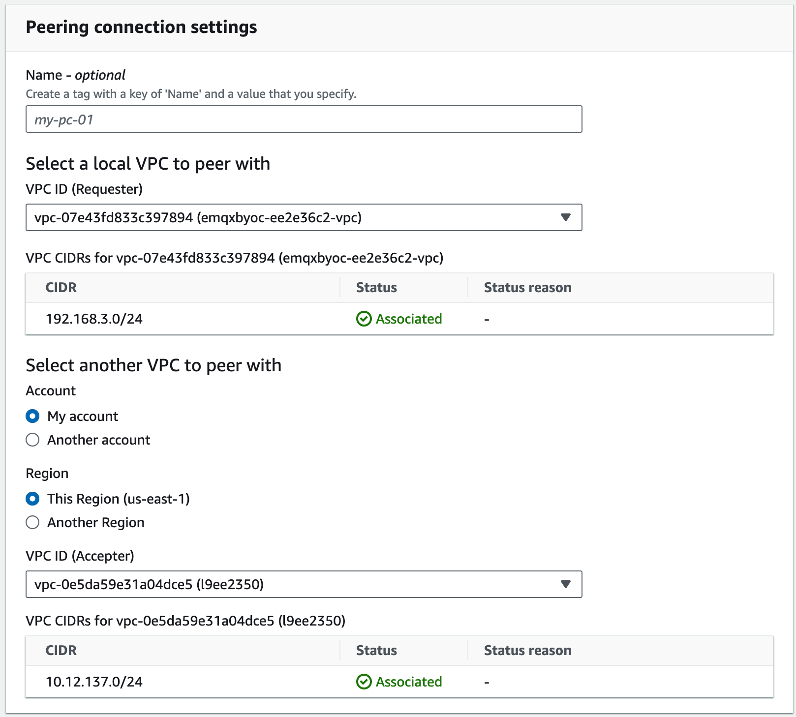
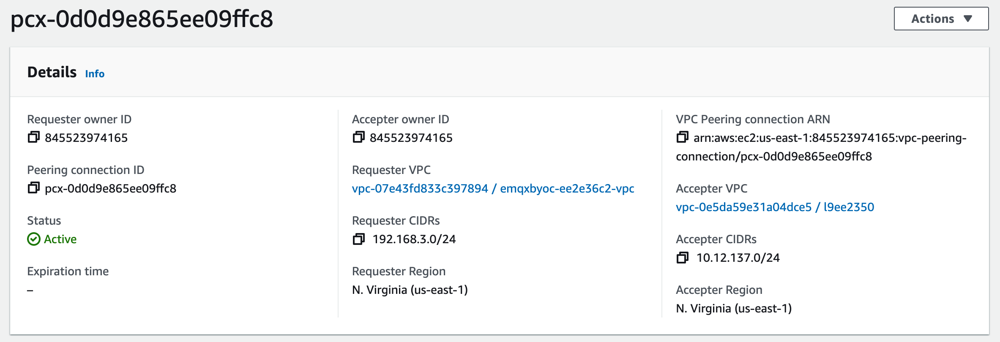
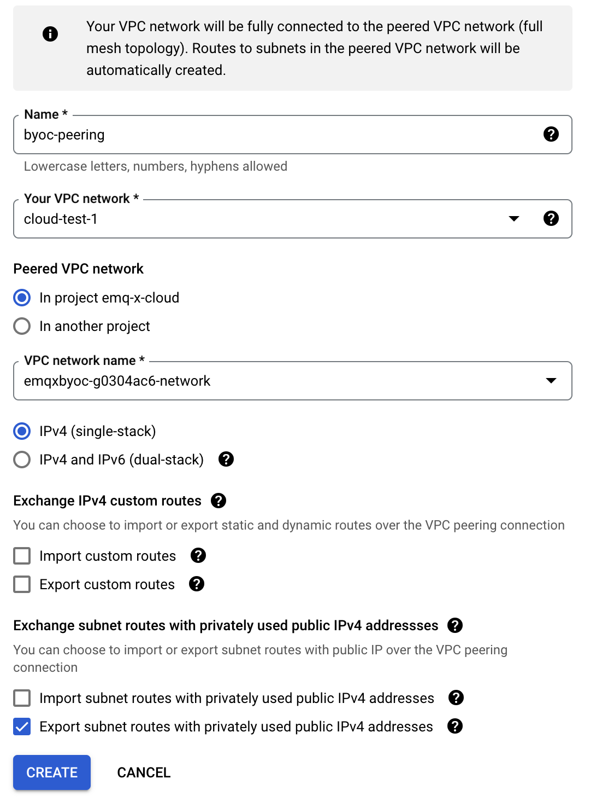

# VPC Peering Setting

A VPC peering connection is a networking connection between two VPCs that enables you to route traffic between them privately. Instances in either VPC can communicate with each other as if they are within the same network. 

If you need to transfer data between EMQX Cloud BYOC deployment and other cloud services, you need to configure a peer connection between the VPC where the deployment is located and your other VPCs. This guide describes how to create a peering connection and make the relevant settings in the cloud platforms when the BYOC is deployed in AWS and Google Cloud Platform.

## Precautions

1. You can create VPC peering connection within the same region or within different regions. Cross-region peering connections may incur charges.
2. When creating a BYOC deployment, please pay attention to the CIDR and make sure that it is not on the same CIDR as the VPC **where other services are located**. Please prepare your VPC CIDR inadvance.

## VPC Peering Connection in AWS

This section describes how to create VPC peering connections and create routing and security group rules in AWS. You can find more about [VPC peering connection](https://docs.aws.amazon.com/vpc/latest/peering/working-with-vpc-peering.html).

::: tip
- Requester VPC : VPC of BYOC deployment.
- Accepter VPC : VPC where the services are located.
:::

### Create VPC Peering Connection

1. Open the Amazon VPC console at https://console.aws.amazon.com/vpc/. In the navigation pane, choose `Peering connections`. Choose `Create peering connection`. 
    * Set a name for this VPC peering connection.
    * VPC ID (Requester): Select the requester VPC in your account with which to request the VPC peering connection. It's the VPC with BYOC deployent, with a name like `emqxbyoc-XXXX-vpc`.
    * Save the requestor **VPC CIDRs**, which will be used in later steps.
    * Account: Choose My account.
    * Region: Choose the region for the accepter VPC. In this case, we choose `This Region`
    * VPC ID (Accepter): Select the accepter VPC in which you want to transfer the data to the service.
    * Save the accepter **VPC CIDRs**, which will be used in later steps.
    
    

2. Click `Create peering connect`. Then choose `Actions`, `Accept request`. The status of VPC peering connection will be **Active**. Please save VPC peering connection ID start with `pcx-`.

    

### Configure Route tables

#### Requester VPC

1. Open the Amazon VPC console. In the navigation pane, choose `Route tables`. Find the route table of Requester VPC, with the name like `emqxbyoc-xxxx-private-route-table`. The choose `Edit routes`.

2. Click `Add route`, fill in the destination input with accepter **VPC CIDRs**, and fill in the target input with the **Peer Connection ID** beginning with `pcx-`.

    

#### Accepter VPC

1. Open the Amazon VPC console. In the navigation pane, choose `Route tables`. Find the route table of Accepter VPC.

2. Click `Add route`, fill in the destination input with requester **VPC CIDRs**, and fill in the target input with the **Peer Connection ID** beginning with `pcx-`.

    

### Configure Security Group

1. Open the Amazon VPC console. In the navigation pane, choose `Security groups`. Find the Security group of Requester VPC. In `Inbound rules` section, click 'Edit inbound rules', add a new rule. Choose All TCP and add the accepter **VPC CIDRs**.

2.  Find the Security group of Accepter VPC. In `Inbound rules` section, click 'Edit inbound rules', add a new rule. Choose All TCP and add the requester **VPC CIDRs**.

## VPC Peering Connection in GCP

This section describes how to create VPC peering connections in GCP. You can find more about [VPC network peering](https://cloud.google.com/vpc/docs/using-vpc-peering).

1. In the Google Cloud console, go to the VPC Network page. In the navigation menu, choose `VPC network peering`. Click `CREATE PEERING CONNECTION`, Click `Continue`.

2. Configure Peering Connection by BYOC VPC
    * In the Name field, enter a name for your peering configuration.
    * Under Your VPC network, select VPC of BYOC deployment, with the name like `emqxbyoc-xxxx-network`.
    * Choose the same project or in another project. In this case, we choose `In project emq-x-cloud`.
    * Choose the VPC of web service.
    * Click `Create`
    

    The status of peering connection will be inactive. We need to set up the peering connection from target VPC to complete the connection.

3. Configure Peering Connection by service VPC
    * In the Name field, enter a name for your peering configuration.
    * Under Your VPC network, select VPC of target service.
    * Choose the same project or in another project. In this case, we choose `In project emq-x-cloud`.
    * Choose the VPC of BYOC deployment, with the name like `emqxbyoc-xxxx-network`.
    * Click `Create`
    

    After creating the peering connection from both sides, we wait until VPC network peering active.
