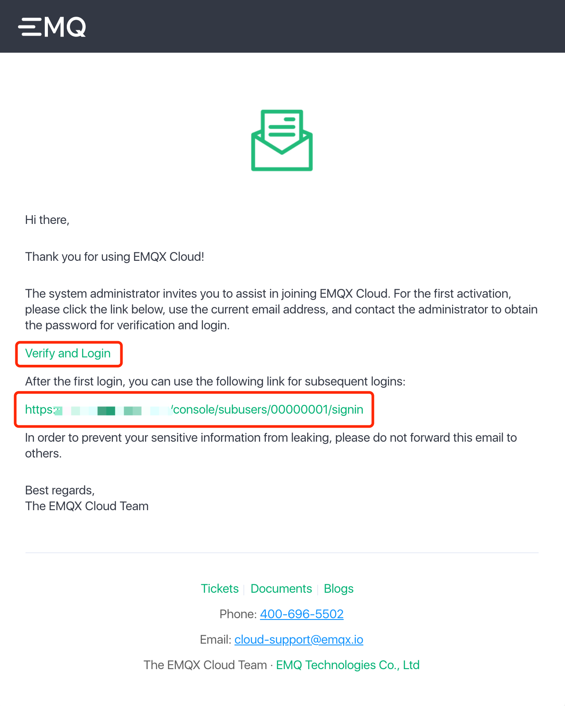

# Subaccount Management

You can click the **Subaccount** from the top menu to enter the Subaccounts page.

## Create a Subaccount

1. Click the **Create Subaccount** button in the top right corner.
1. Enter the following information, items marked with an asterisk are required.
	* Enter the email address of the inviter.
	* Enter the password, which can be changed by the administrator later.
	* Select an associate role(s). You can select one or more roles.
	* Enter the note (optional).

3. Click the **Confirm** button.

   

4. Login to the invitee email to receive the invitation email and use the link to verify and activate the subaccount. Note that there are two addresses in the invitation email, one for the first activation and login, and the other is the usual login address for subsequent logins. The password for the subaccount should be issued by the administrator who activated the subaccount (or get it from the administrator).

   
 > The first link is for first time activation of login, and the second link is the link for the subsequent login, please don't get confused.
5. After subaccount login, you can manage the platform according to the permissions set by the system. If you need the permissions of a certain project, please contact the administrator.

## Subaccounts

The subaccounts function is only open to subaccounts with two roles: the administrator has full operational privileges and the auditors can view the user list.

Please note that subaccounts are not available for the account's default project.

The subaccount login address is distinguished from the regular login page and is used exclusively for subaccount login. It can be sent when the login address is forgotten.

The account list shows the current subaccounts information, and the status will be changed to enabled only if the subaccount has passed the email authentication. When a new user is created as project administrator or project user role, it will prompt to authorize the project for that user, otherwise the subaccount will not have any project and deployment permissions after logging in.

It is important to note that the project authorization function is disabled when the role of the subaccount is changed to Accountant, Auditor, or Administrator. That's because the Administrator has all project permissions by default, and Accountant and Auditor have all project read-only permissions by default.

> When a subaccount has both project administrator and project user roles, remember to switch between roles for authorization

### More Operating Options

**Change Password**：Currently, only the administrator can change passwords for subaccounts.

**Change Role**：Modifying or reassigning roles for subaccounts.

**Disable / Enable**：After deactivating a subaccount, the subaccount cannot log in until the subaccount is re-enabled.

> * When the role is deactivated it cannot be associated with projects and do not appear in the Project Center associated list.

**Delete**：Deleted subaccounts cannot be recovered.
