# Integrate with AWS RDS MySQL

AWS RDS (Amazon Relational Database Service) is a managed relational database service provided by Amazon Web Services (AWS). It allows users to easily create, manage, and scale relational databases in the cloud without worrying about the underlying infrastructure operations.


AWS RDS supports multiple database engines, including MySQL, PostgreSQL, Oracle, SQL Server, and Amazon Aurora (a highly compatible database engine with MySQL and PostgreSQL). Here, we will focus on AWS RDS MySQL.
 

In this article, we will simulate temperature and humidity data and report it to EMQX Cloud using the MQTT protocol. Then, we will use EMQX Cloud data integration to store the data in AWS RDS MySQL.


1. Log in and Use AWS RDS MySQL

2. Create VPC Peering Connection

3. Create Resources

4. Create Rules and Actions

5. Complete Data Integration Setup and Perform Testing
 

Note:

This feature is not available in the Standard Plan.

Before using data integration, please ensure you have created the deployment.[Create a Dedicated deployment.](../create/dedicated.md)

For Professional Plan deployment users: Please complete the creation of VPC peering connections first. The IP mentioned below refer to the resources' private IP. (If [NAT gateway service](../vas/nat-gateway.md) is enabled, public IP can also be used for connection.)

## 1.Log in and Use AWS RDS MySQL

Firstly, log in to AWS, search for Amazon RDS, and create an AWS RDS MySQL instance based on your specific requirements. Pay particular attention to the VPC security group settings, as they will be highlighted in section  
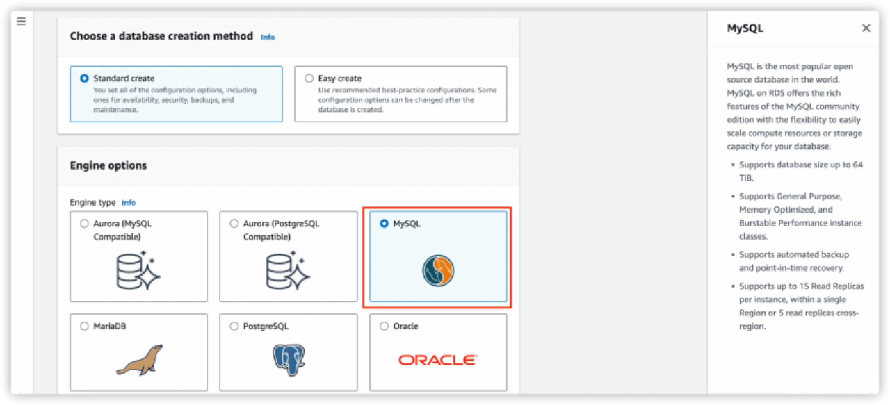


 

Afterward, refer to the documentation "Creating and connecting to a MySQL DB instance" at the following link:

https://docs.aws.amazon.com/AmazonRDS/latest/UserGuide/CHAP_GettingStarted.html

 

Use an EC2 instance to connect to your AWS RDS MySQL instance and create the MQTT database.

 


## 2.Create VPC Peering Connection

1. Log in to [EMQX Cloud console](https://cloud-intl.emqx.com/console), go to the deployment details page, click the + VPC Peering Connection button, and record Region of deployment，VPC ID of deployment，CIDR of deployment，Account ID of EMQX Cloud in the pop-up dialog box, which need to be used later. Please don’t close this dialog box
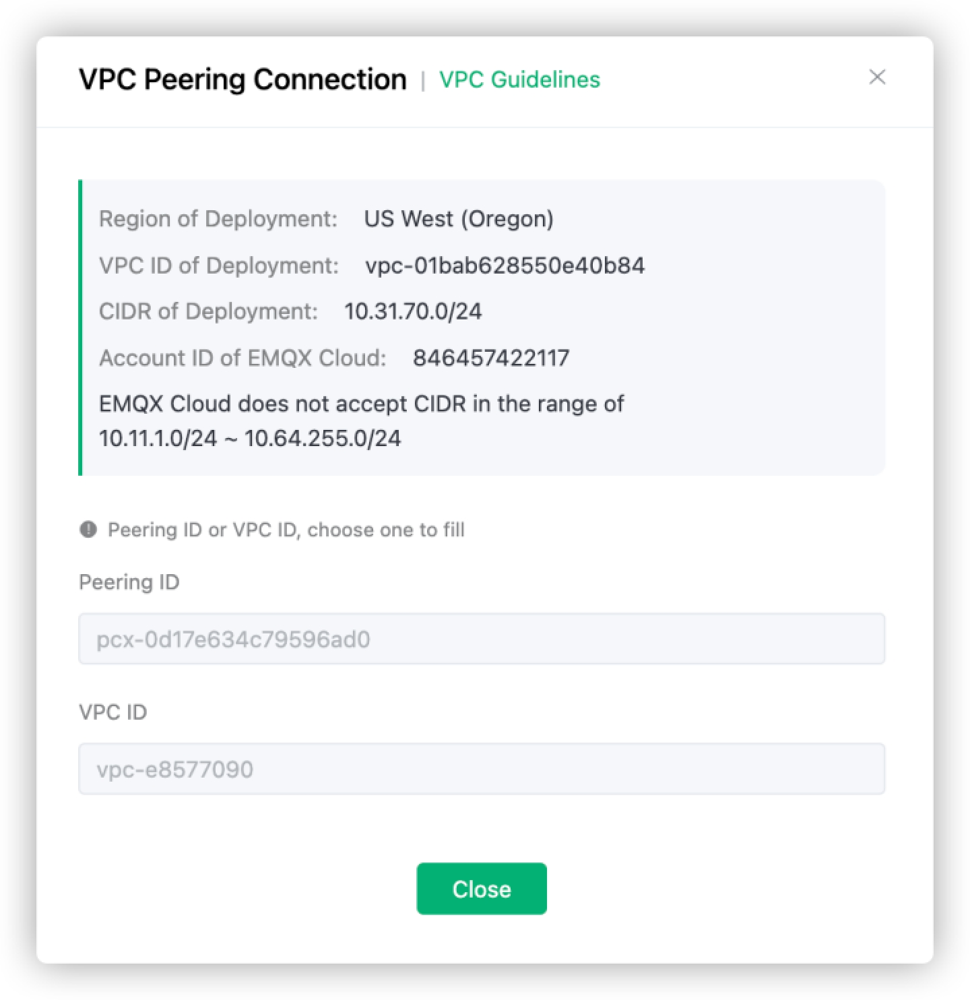
2. Log in to the Amazon Web Services console, switch to the region where Region of deployment is recorded in step 1, go to Networking & Content Delivery -> VPC -> Peering Connection, and click the button of Create Peering Connection

 

Select Another account of Account，Account ID , fill in the Account ID of EMQX Cloud recorded in step 1

Select This region(us-east-1) of Region

For VPC (Accepter), fill in the VPC ID of deployment in step 1.
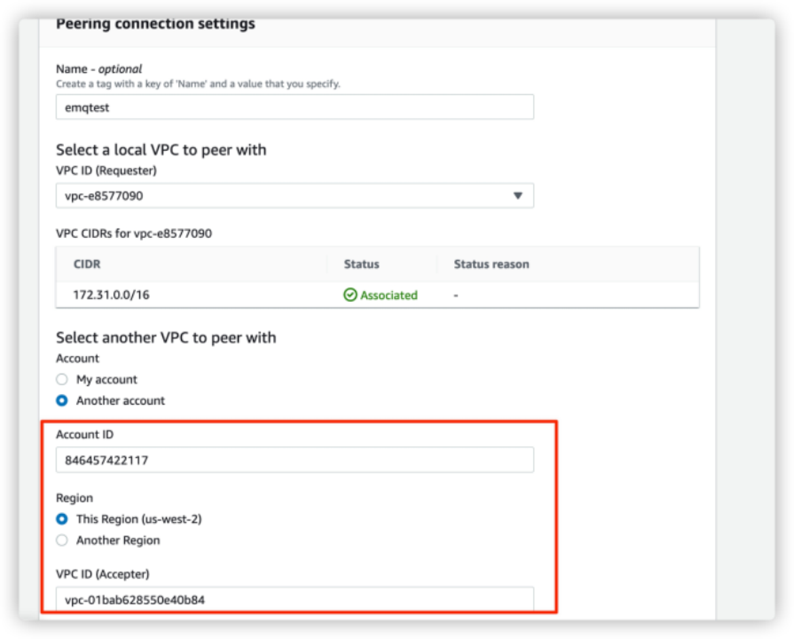

After filling in all the information, click the button of Create Peering Connection

 

Note that when establishing a VPC peering connection, the local VPC ID refers to the VPC to which AWS RDS MySQL belongs.
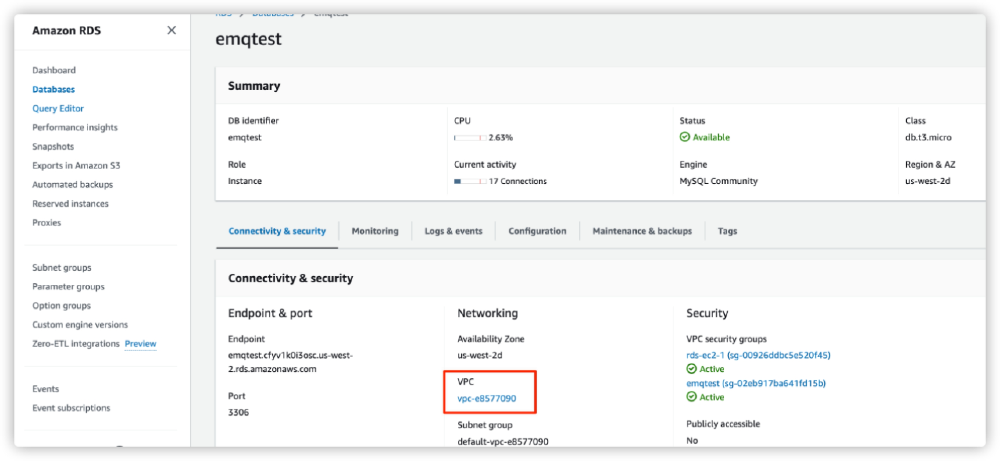 

 

3. Once created, the following will be displayed. Please record Requester VPC owner, Requester VPC , Peering Connection ID, which need to be used later
   

 

4. Return to EMQX Cloud console, fill in the information recorded in step 3, and click the Confirm button to complete the creation of the peering connection

For Peering ID, fill in the recorded Peering connection ID

For VPC ID, fill in the recorded Requester VPC 
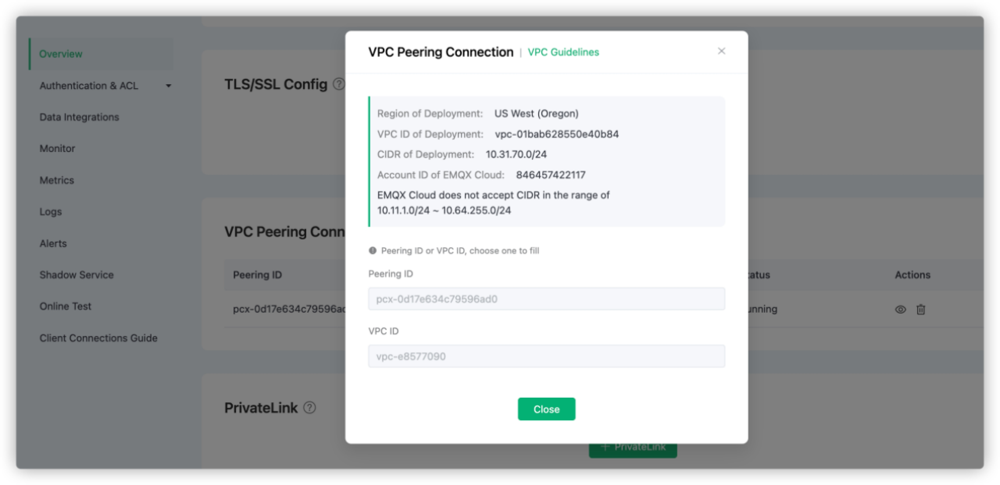

 

Make sure that the status of the VPC Peering Connection is running

 

 

5. Return to Amazon Web Services console, go to Networking & Content Delivery -> VPC -> Route Tables, add the CIDR of deployment recorded in step 1 to the route table of the corresponding VPC,Target selects peer connection

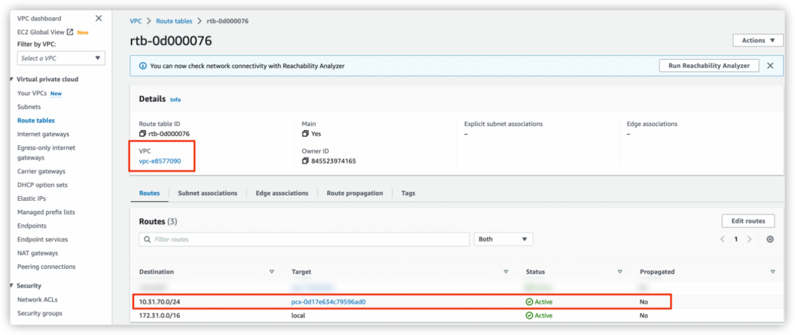

 

6. Go to Networking & Content Delivery -> VPC -> Security Groups,configure the security group bound to the corresponding VPC, edit inbound rules and add a rule

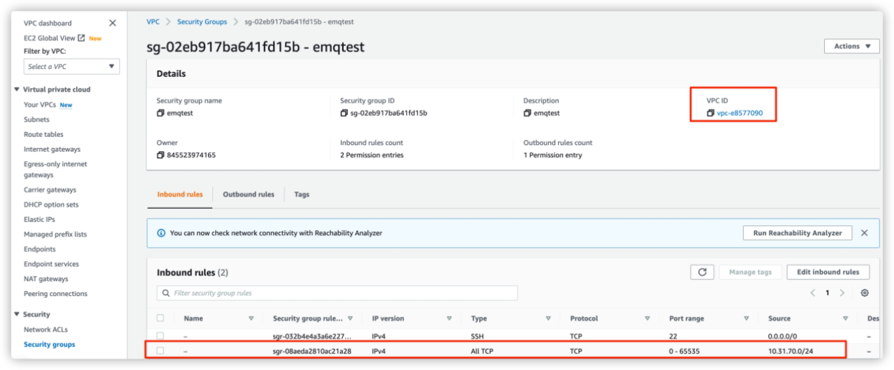


## 3. Create Resources

Go to Deployment Details and click on Data Integrations on the left menu bar.

 

1.Create MySQL Resource.

 

Click on MySQL under the Data Persistence.

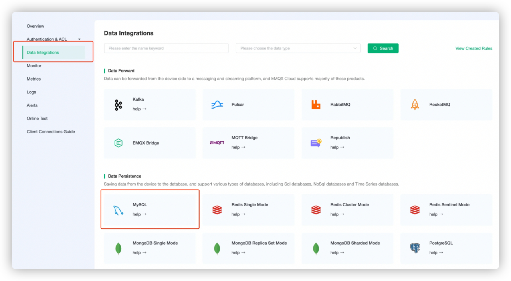 

 

Fill in the information of the mysql database you have just created and click Test. If there is an error, you should check if the database configuration is correct. Then click on New to create MySQL resource.

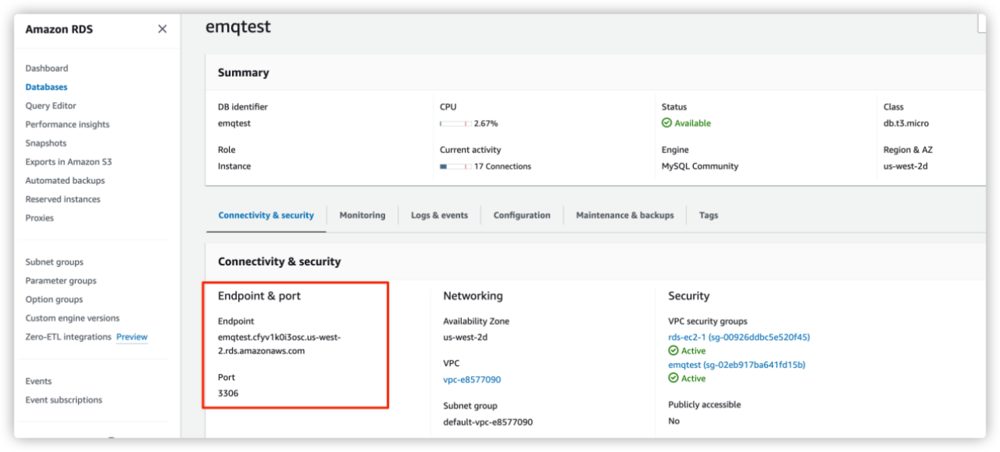 

 

## 4. Create Rules and Actions

Choose the MySQL resource under Configured Resources, click on New Rule and enter the following rule to match the SQL statement. In the following rule, we read the time when the message was reported up_timestamp, client ID, payload via temp_hum/emqx topic. Also, we can read temperature and humidity from this topic.

 

```
SELECT 
timestamp AS up_timestamp, 
clientid AS client_id,
payload.temp AS temp, 
payload.hum AS hum 
FROM 
"temp_hum/emqx"
```


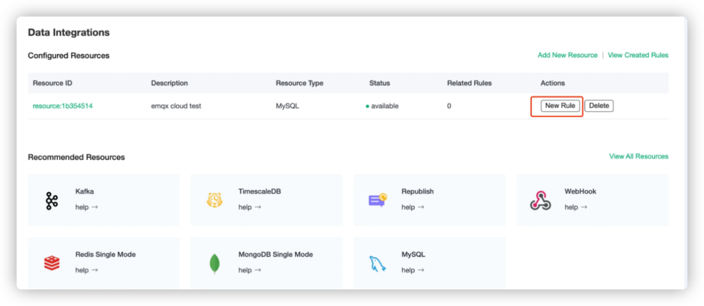 

You can use SQL Test to see the result


Add Action.

Click on the Next action in the bottom to enter action view. Select the resource created in the first step, select Data Persistence - Data to MySQL as Action Type, and enter the following data to insert into the SQL template.

```
INSERT INTO temp_hum(up_timestamp, client_id, temp, hum) VALUES (FROM_UNIXTIME(${up_timestamp}/1000), ${client_id}, ${temp}, ${hum}) 
```

 

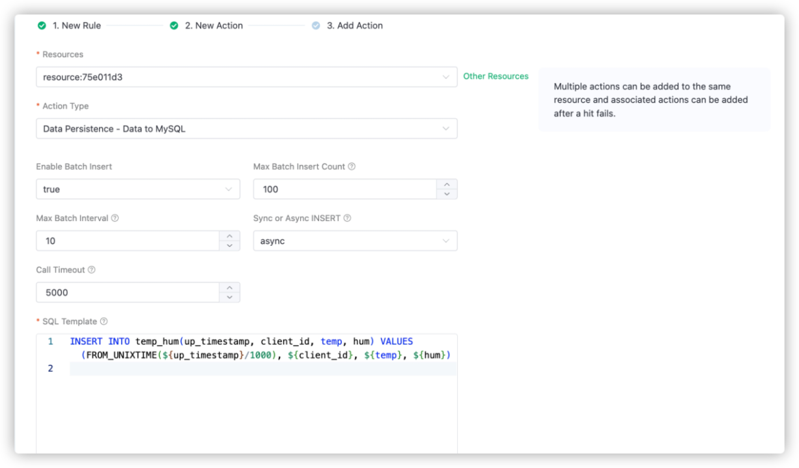 

 

## 5.Complete Data Integration Setup and Perform Testing

 Data integration rule has been created.

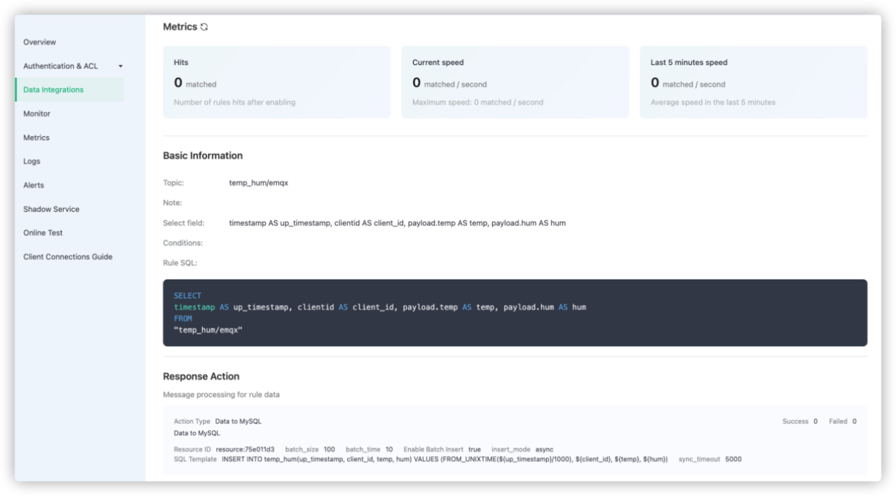 

 

 Create a table named "temp_hum" in AWS RDS MySQL using EC2.

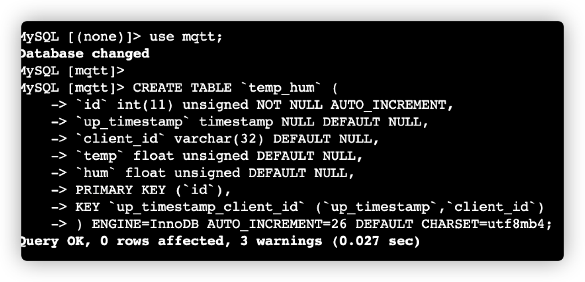 


 Use the MQTTX tool to connect to the EMQX Cloud deployment and test data upload.

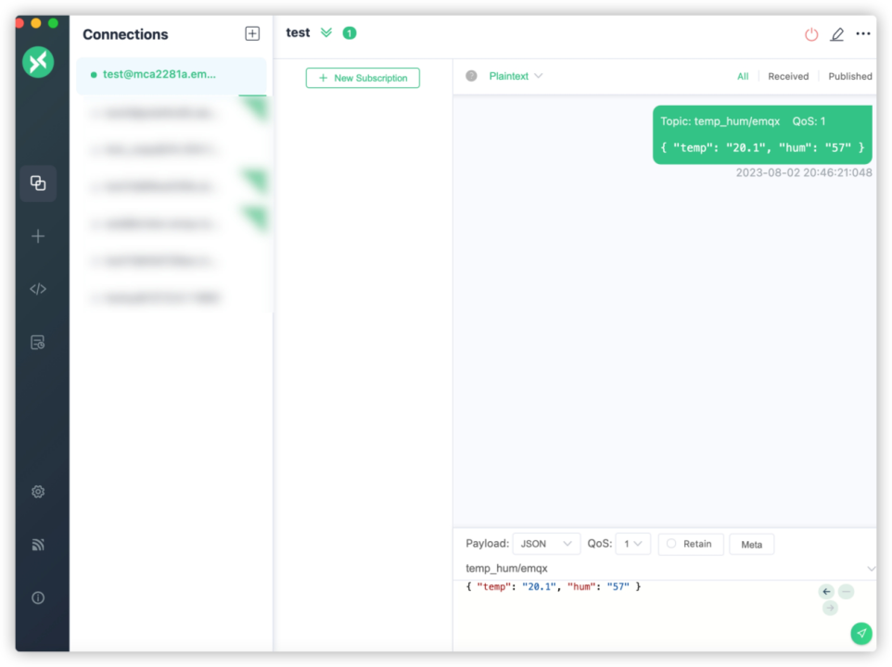 


 View rule monitoring, and the count has been successfully increased.

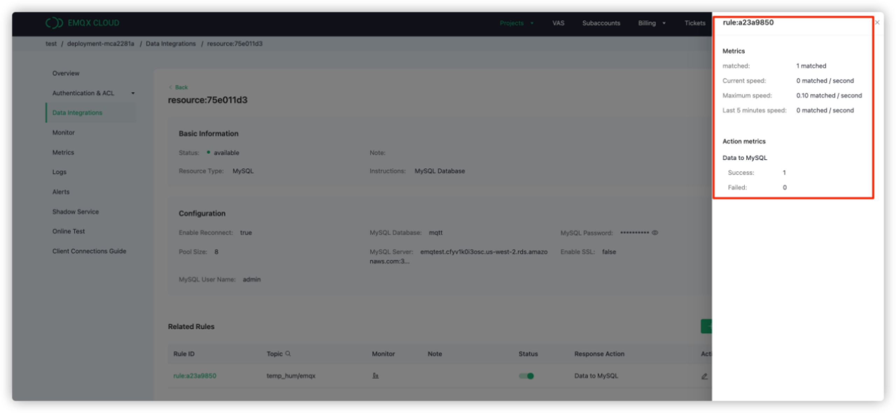 

View the data stored in the "temp_hum" table on EC2.

 