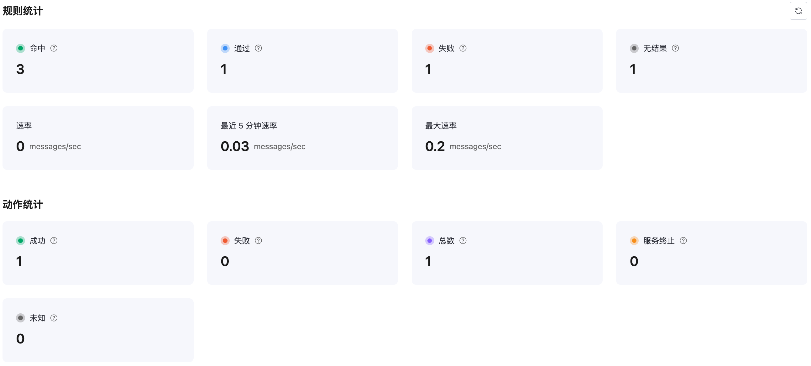
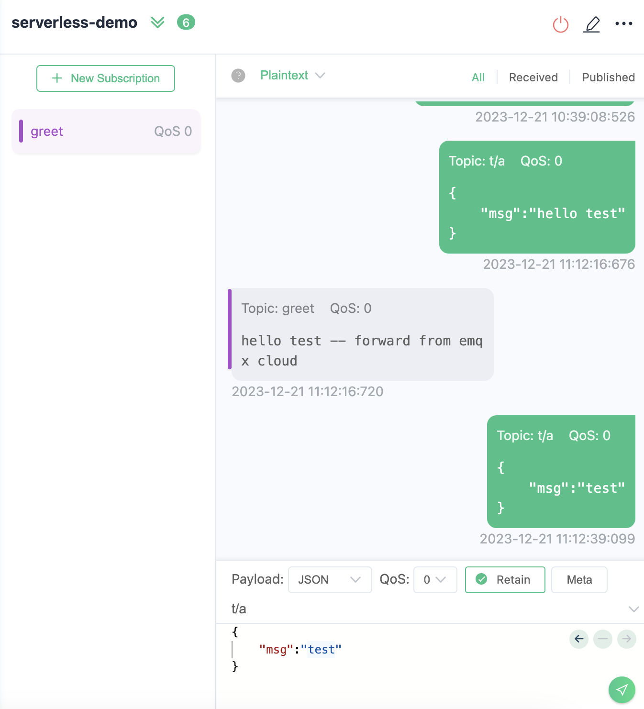

# 消息重新发布

通过 EMQX Cloud 数据集成，可以在不编写代码的情况下，将满足某一特征的消息重新发布到其他主题上。您可以在 EMQX Cloud 中创建规则、定义规则 SQL 筛选并处理来自源消息的数据，并为规则添加“消息重新发布”动作，实现将处理结果通过消息发布进行转发。

本页演示了如何通过创建数据集成以实现：当任合一条消息的 `msg` 包含 `hello` 字符串时，将此消息重新发布到 `greet` 主题。主要步骤包括：

1. 创建规则为数据集成设置筛选条件。
2. 为规则添加一个动作以进行消息重新发布。
3. 完成数据集成创建，并进行测试。

通过数据集成配置消息重新发布功能无需添加任何连接器。以下章节介绍了具体的配置步骤。

## 创建规则

1. 在**数据集成**页面中的**数据转发**服务分类下点击**消息重新发布**。如果您已经创建过其他的连接器，则点击**新建连接器**，然后在**数据转发**服务分类下选择**消息重新发布**。
2. 在 **SQL 编辑器**中定义规则 SQL 以满足任何消息中只要 `msg` 中包含 `hello` 字符串，就会触发引擎：

   - 在 FROM 子句中指定消息数据的来源。本演示针对所有的主题的消息，即 `#`。
   - 在 WHERE 子句中对消息 payload 中的 `msg` 进行正则匹配，含有 `hello` 字符串再执行数据集成。

   根据上面的原则定义的 SQL 示例如下：

   ```sql
   SELECT
     payload.msg as msg
   FROM
     "#"
   WHERE  
     regex_match(msg, 'hello')
   ```

3. 可以点击 SQL 输入框下的 SQL 测试 ，填写数据：

   - topic: t/a
   - payload:

   ```json
   {
     "msg":"hello test"
   }
   ```

   点击测试，查看得到的数据结果，如果设置无误，测试输出框应该得到完整的 JSON 数据，如下：

   ```json
   {
     "msg":"hello test"
   }
   ```

   测试输出与预期相符则可以进行后续步骤。
   >注意：如果无法通过测试，请检查 SQL 是否合规。
   


## 添加动作

1. 在创建规则页面上点击**下一步**，添加动作。
2. 在动作页面中，目标主题设为 `greet`，在消息内容模板里填写 `${msg} -- forward from emqx cloud`，QoS 为默认值。点击**确定**完成配置。


## 测试消息重发布

我们推荐使用 [MQTTX](https://mqttx.app/) 模拟消息上报，同时您也可以使用其他任意客户端完成。
1. 使用 MQTTX 连接到部署，并向 `test` 主题发送消息。

   ```json
   {
     "msg": "hello"
   }
   ```

2. 在规则列表中找到消息重新发布的规则，点击规则 ID 进入规则统计页面，在页面中可以看到相关的统计指标。


3. 客户端订阅 `greet` 主题，可以看到如果 `msg` 包含 `hello`，消息将被转发，如果不包含，则不会转发。

